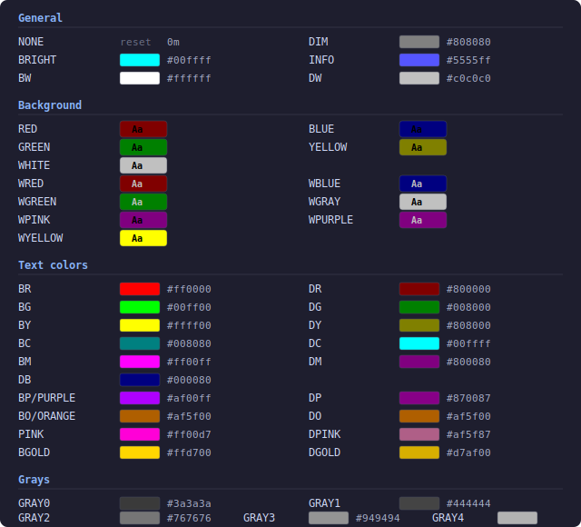

# GPPU — General Purpose Python Utilities

<h3><code>v3</code> — <em>All the things</em></h3>

> YAML-driven configuration with `!include`, colored structured logging, type coercion, deep dict access, YAML/JSON I/O, template population, time helpers, OS detection, async-to-sync, multi-backend caching, PostgreSQL and SQLAlchemy base classes, Textual TUI framework with superapp launchers, nested apps, config editors, web UI via `--serve`, and CLI fallback, Selenium Chrome automation, and home automation types.

[](https://github.com/akarelin/gppu/releases?q=gppu)

---

| | CI | |
|---|---|---|
| **gppu** |  | Core library |
| [**Statusline**](statusline/) | [](https://github.com/akarelin/gppu/actions/workflows/statusline.yml) | Claude Code status line (Linux, macOS, Windows) |
| [**W11**](w11/README.md) | [](https://github.com/akarelin/gppu/actions/workflows/w11.yml) | Windows 11 utilities & diagnostics |

# Modules

| Module | Purpose |
|--------|---------|
| `gppu` (core)<br>[](https://github.com/akarelin/gppu/actions/workflows/gppu.yml) | **Environment**: `Env` config loader with `!include`, typed path access (`glob`, `glob_int`, `glob_list`, `glob_dict`). **Logger**: colored `Info`/`Warn`/`Error`/`Debug`/`Dump`. Plus: type coercion, dict utilities, YAML/JSON I/O, time helpers, OS detection, async helpers, template population |
| [`gppu.data`](DATA.md) | `Cache` unified caching (JSON/pickle/sqlite/diskcache/DB backends), database base classes: `_PGBase` (psycopg2) and `_SQABase` (SQLAlchemy) |
| [`gppu.tui`](TUI.md) | `TUIApp`, `TUILauncher`, `ConfigEditorApp`, `ui_select`, `ui_select_rows` — Textual-based TUI framework with web mode (`--serve`), CLI fallback, app embedding. Requires `tui` extra |
| [`gppu.chrome`](CHROME.md) | `prepare_driver`, `switch_to_mobile`, `switch_to_desktop` — Selenium Chrome driver setup with profile management, crash recovery, mobile/desktop emulation |
| [`gppu.ad`](AD.md) | Home automation types (`y2list`, `y2path`, `y2topic`, `y2slug`, `y2eid`), `DC` pseudo-dataclass |

## Environment

```python
from gppu import Env
from pathlib import Path

# Initialize: resolves config file, loads YAML (with !include support)
Env.from_env(name='myapp', app_path=Path('CRAP/file_indexer'))

# Typed access via "/" path
db_host = Env.glob('database/host', default='localhost')
port    = Env.glob_int('database/port', default=5432)
tags    = Env.glob_list('metadata/tags')
options = Env.glob_dict('database/options')
```

Config file resolution: looks for `<name>.yaml` then `config.yaml` in the app path. Base paths are OS-aware (e.g. `/home/alex` on Linux, `D:\Dev` on Windows).

YAML `!include` support:
```yaml
app:
  name: MyApp
  database: !include database.yaml
```

## Logger

```python
from gppu import Info, Warn, Error, Debug, Dump

Info('WBLUE', 'server', 'NONE', 'started on port', 'BG', '8080')
Warn('WYELLOW', 'config', 'NONE', 'key missing, using default')
Error('WRED', 'database', 'NONE', 'connection refused')
Debug('GRAY4', 'trace', 'NONE', 'processing item')

Dump('debug_state.yml', data)
```

## How Apps Work

Every app follows the same pattern: a YAML config file is the single source of truth, and `Env.from_env()` loads it at startup. The app reads all its settings from `Env.glob()`.

### 1. Create a config — `myapp.yaml` next to your script:

```yaml
logs:
  - Application
  - System
level: Warning
days: 30
error_rules: !include error_rules.yaml
```

### 2. Initialize and read config:

```python
from gppu import Env, Info, glob, glob_int, glob_list
from pathlib import Path

Env.from_env(name='myapp', app_path=Path(__file__).parent)

logs  = glob_list('logs')
level = glob('level', default='Warning')
days  = glob_int('days', default=10)

Info('WBLUE', 'myapp', 'NONE', 'loaded', 'BG', str(len(logs)), 'NONE', 'logs')
```

### 3. For TUI apps — subclass `TUIApp` and use `Env` the same way:

```python
from gppu import Env
from gppu.tui import TUIApp

class MyApp(TUIApp):
    TITLE = 'My App'
    def compose(self):
        ...

Env.from_env(name='myapp', app_path=Path(__file__).parent)
MyApp.main()  # TUI if terminal available, CLI fallback otherwise
```

### 4. For superapp launchers — a launcher config lists sub-apps, each with its own YAML:

```yaml
# launcher.yaml
apps:
  events: events.yaml
  onedrive: onedrive.yaml
```

Each sub-app YAML has a `manifest:` section (name, icon, script, modes) plus app-specific config below it. The launcher loads all manifests and presents a menu.

```python
from gppu import Env
from gppu.tui import TUILauncher, launcher_main, load_app_registry

APP_DIR = Path(__file__).parent

class MyLauncher(TUILauncher):
    TITLE = 'My Tools'

Env.from_env(name='launcher', app_path=APP_DIR)
apps = load_app_registry(APP_DIR)
launcher_main(apps, MyLauncher, APP_DIR, 'My Tools')
```

See [w11/app.py](w11/app.py) for a real example.

# Other Prodducts

[Statusline](statusline/) — Claude Code status line tool

[W11](w11/README.md) — Windows 11 utilities


# Appendix
## Installation

```bash
# From GitHub
pip install "gppu @ git+ssh://git@github.com/akarelin/gppu.git@gppu/latest"

# With optional extras
pip install "gppu[pg] @ git+ssh://git@github.com/akarelin/gppu.git@gppu/latest"
pip install "gppu[all] @ git+ssh://git@github.com/akarelin/gppu.git@gppu/latest"

# Local development
pip install -e ".[all,test]"
```

**Optional extras**: `pg` (psycopg2), `sql` (SQLAlchemy), `cache` (diskcache), `chrome` (Selenium), `tui` (Textual), `serve` (textual-serve), `statusline` (Jinja2), `all`, `test` (pytest).

Requires Python >= 3.11. Core dependency: PyYAML.

## TColor Reference

Hex values computed from ANSI codes in `gppu/gppu.py` (xterm-256color palette).




## License

Extracted from RAN project for reuse across Alex Karelin's automation and data processing tools.
