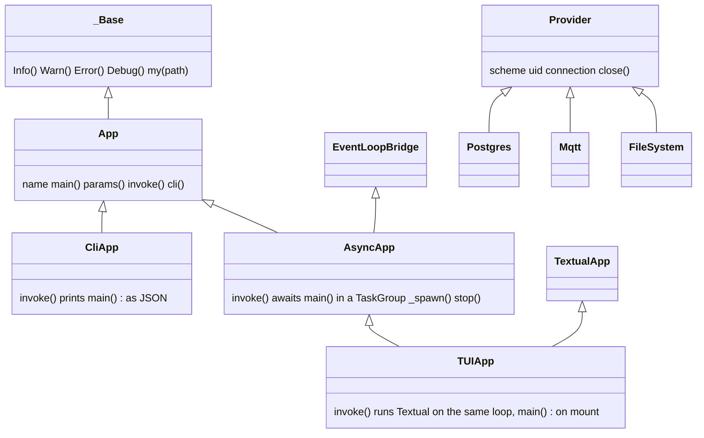

# gppu.next

Branch `next` of the gppu repository: the next gppu, started from the gppu.next mock-up. The released package (3.6.20) is on master; its source is kept here under `archive/gppu-3/` as the source for porting the providers.

Goal (Alex, 2026-09-25): gppu CLI apps get their parameters and environment the way Windmill scripts do, and reach other services as easily. Redundant classes go. A bare-minimum core is separated from providers. TUI and async apps are the same kind of app, and CliApp is another subtype of a generic App.

## What an app looks like

```python
from gppu import CliApp
from gppu.postgres import Postgres

class Archive(CliApp):
  def main(self, since: str = '7d', dry_run: bool = False, db: Postgres = 'pg-lake') -> dict:
    """Report what would be archived.

    Args:
      since: How far back to look.
    """
    return {'since': since, 'rows': db.scalar('select count(*) from files.lake')}

if __name__ == '__main__': Archive.cli()
```

```
archive                         everything from config.yaml and the signature
archive --since 3d --db pg-trix   --db accepts only the configured Postgres connections
archive --schema                the parameters as JSON Schema
```

- **Parameters** come from `main`'s signature. Each one is a typed option (`str`, `int`, `float`, `bool` as `--x/--no-x`, `list[...]`, `Literal[...]`, `Path`, `dict` as JSON). The first docstring line is the description, and the `Args:` lines are the help.
- **Values** come from the command line first. Next comes the app's configuration under the parameter's name, then the signature's default. Anything still missing raises. So an app runs with zero arguments, and flags override configuration.
- **Services**: a parameter annotated with a Provider receives a Connection. Its value is a connection uid from the `connections` table. With no uid anywhere, the one configured Connection of that Provider is used; none or several raises.
- **Results**: CliApp prints what `main` returns as JSON on stdout, and logs go to stderr.
- **Other apps**: `run(Archive, since='3d')` or `run('crap.archive:Archive')` starts another app from code, with the same resolution. Connections are shared by uid, so the caller's stay open; they close when the command line that started the process returns.

## Windmill → gppu

| Windmill | gppu.next |
|---|---|
| `main(a: int, db: postgresql)` | `main(self, a: int, db: Postgres)` |
| resource type | Provider class (`gppu.postgres.Postgres`) |
| resource `f/db/pg.resource.json` | row in the `connections` table: `pg-lake: {provider: gppu.postgres.Postgres, dsn: !secret pg-lake-dsn}` |
| `$res:f/db/pg` as an argument | `--db pg-lake` |
| `$var:g/all/pw`, `wmill.get_variable` | `!secret pw`, `Vault.get('pw')` |
| `wmill.get_resource(path)` | `connection('pg-lake')` |
| `wmill.run_script_by_path` | `run('module:Class', **args)` |
| auto-generated input form | `schema(app.main)`, `--schema`; the same description serves gppu.rest |
| return value is the job result | CliApp prints the return value as JSON |

My reading, for Alex to correct: "easy to use other services from cli" means a service is a typed parameter, picked by uid on the command line or found in configuration. It is never code in the app.

## Hierarchy


```mermaid
classDiagram
  _Base <|-- App
  App <|-- CliApp
  App <|-- AsyncApp
  EventLoopBridge <|-- AsyncApp
  AsyncApp <|-- TUIApp
  TextualApp <|-- TUIApp
  Provider <|-- Postgres
  Provider <|-- Mqtt
  Provider <|-- FileSystem
  class _Base { Info() Warn() Error() Debug() my(path) }
  class App { name main() params() invoke() cli() }
  class CliApp { invoke() prints main() as JSON }
  class AsyncApp { invoke() awaits main() in a TaskGroup _spawn() stop() }
  class TUIApp { invoke() runs Textual on the same loop, main() on mount }
  class Provider { scheme uid connection close() }
```

TUIApp is an AsyncApp. Its TaskGroup opens inside Textual's message loop, so `run`, `run_async` and `run_test` all have it, and `main` runs as a task in it once the screen is mounted. MQTT listeners, timers and REST run on the screen's loop, and quitting the screen cancels them.

## Layout

```
gppu (branch next)/
  core/gppu/          one distribution: PyYAML + Jinja2 only
    gppu.py           utilities, logging, Env, State, Vault, _Base, _DC
    connections.py    Provider, the connections table, connection(uid)
    params.py         signature → parameters, command line, JSON Schema, resolution
    app.py            App, CliApp, AsyncApp, EventLoopBridge, run
  providers/<name>/gppu/...   one distribution each, installing into the gppu package
    tui  postgres  mqtt  azure  fs  iot  rest  data  chrome  y2
  examples/  tests/  run_example.sh
```

Core keeps the import paths that consumers use today: `from gppu.tui import TUIApp` and `from gppu.fs import Location` still work, because `gppu.__path__` is extended by each installed provider. In `core/gppu/gppu.py`, every region above `# region Environment` is copied unchanged from `gppu/gppu.py`. `tui`, `postgres`, `azure`, `mqtt` and `fs` are implemented, and, `iot`, `rest`, `data`, `chrome` and `y2` are docstrings naming what moves there unchanged.

## Every current class

| Current | gppu.next | Why |
|---|---|---|
| `_mixin`, `mixin_Config`, `_Config`, `mixin_Logger`, `protocol_Logger`, `_Logger` | `_Base` | They were the parts of `_Base`. `_config_from_key` and `_config_from_dict` stay; `_config_from_env` goes, because every app now loads its configuration |
| `Logger` | `Logger.trace_folder` only | Logging functions are module-level and per-class on `_Base` |
| `_Base` | `_Base`, strict `my`, `my_int`, `my_list`, `my_dict` | The one foundation. `my` reads the object's own table once `_config_from_key` names it, and an app's parameters read the same table |
| `_App`, `App` | `App` | One generic app; `App` no longer inherits `_DC` |
| — | `CliApp` | New: runs `main` once, prints the result |
| `AsyncApp` (`setup`, `start`, `run`) | `AsyncApp` (`main`, `invoke`) | Same TaskGroup; `main` takes parameters like every app |
| `TUIApp(mixin_Config, textual.App)` | `gppu.tui.TUIApp(AsyncApp, textual.App)` | A TUI is an AsyncApp; `TUIApp.main()`/`cli()` fallback removed |
| `Env` (lenient) + `Environment` (strict) | `Env`, strict | Two views of one configuration. `glob(key, default)` is gone, as CLAUDE.md already requires. `Env.Info` and its siblings still log as the app |
| `State`, `_Rules` | unchanged | |
| `Vault`, `VaultProvider`, `VaultProviderOSEnviron` | core, unchanged | `!secret` resolves while YAML loads; AZURE_KEYVAULT_NAME imports the Azure provider |
| `VaultProviderAzure` | `gppu.azure` | Optional dependency; it no longer swallows every exception as "not found" |
| `_PersistentBase`, `_PGBase`, `_SQABase` | `gppu.postgres.Postgres` | A database is a Connection passed to `main`, not a base class; `_SQABase` has no user |
| `_PersistentDC` | removed | No user |
| `DiskCache = None` | removed | Placeholder for a removed class |
| `Cache`, `Persistence` and their backends | `gppu.data` | Optional dependencies |
| `mixin_Mqtt`, `MqttApp`, `_MqttConfig`, `Env.from_mqtt` | `gppu.mqtt.Mqtt` | A broker is a Connection; configuration over MQTT becomes `Mqtt.config`, and `config(..., wait=True)` replaces `Env.from_mqtt`. An AsyncApp runs on the selector loop on Windows, because aiomqtt needs it |
| `EventLoopBridge` | core | AsyncApp and the IoT controls share it |
| `mixin_Rest` | `gppu.rest` | Describes arguments with `params.schema`, so REST and the command line resolve alike |
| `y2slug`, `y2eid`, `SerializedControl`, `HTTPControl`, `JSONHTTPControl` | `gppu.iot` | Device control is not core |
| `_YMRO`, `_YInit`, `_YLoad`, `_YStart`, `YStepper`, `mixin_Stepper` | `gppu.ymro`, pending decision | Only Y2 uses them |
| `_DC` | core, unchanged | State builds rows with it |
| `OSType`, `Span`, `TimeSpan`, `y2list`, `y2path`, `y2topic`, `y2uri`, `TColor`, `JinjaEnvironment`, `JinjaDocument`, `TemplateSet` | core, unchanged | |
| `Provider` (gppu.fs) | core `Provider` (scheme, uid, connection, close); the object methods stay on the fs Provider | Every service is a Provider now, not only object stores |
| gppufs: `DataObject`, `Container`, `Location`, `Collection`, `FileSystem`, handlers, `GppuCatalog`, the fsspec filesystems | `gppu.fs`, unchanged | `GppuCatalog` reads `connections` through core, so a Location and an app share one Connection instance |
| `TUILauncher`, `AppScreen`, the widgets, `Selector` | `gppu.tui`, unchanged | `AppScreen` runs the wrapped app's `main` on the launcher's loop; `launcher_main` runs the launcher through `invoke` |
| `DetailedSelector` | `gppu.tui`, unchanged | `ui_select_rows` is built on it |
| `chrome` helpers | `gppu.chrome` | Optional dependency |

## Decisions for Alex

- Where the Y2 lifecycle (`_YMRO` … `mixin_Stepper`) lives: in the y2 repo, or in a gppu provider. Only Y2 uses it.

## Consumer impact when this replaces gppu

- `glob(key, default)` and `my(key, default)` are gone, because lookups are strict. A few consumers still pass defaults.
- TUIs that call `_config_from_env()` drop the call.
- The gppufs classes are imported from `gppu.fs`, no longer from `gppu`.
- `_PGBase` subclasses take `db: Postgres` in `main`, and the `db` connection string becomes a `connections` row.
- `MqttApp` subclasses become `AsyncApp` with `mqtt: Mqtt`.
- Hand-rolled `argparse` in CLI scripts is replaced by `main`'s signature.

## Run

```
PYTHON=~/.venv/Scripts/python.exe run_example.sh archive --since 3d
~/.venv/Scripts/python.exe -m pytest tests
PYTHONPATH=core python -c "import gppu.app, sys; print(sorted({m.split('.')[0] for m in sys.modules} & {'textual','fsspec','psycopg2','aiomqtt','azure'}))"   # [] : core needs no provider
```
